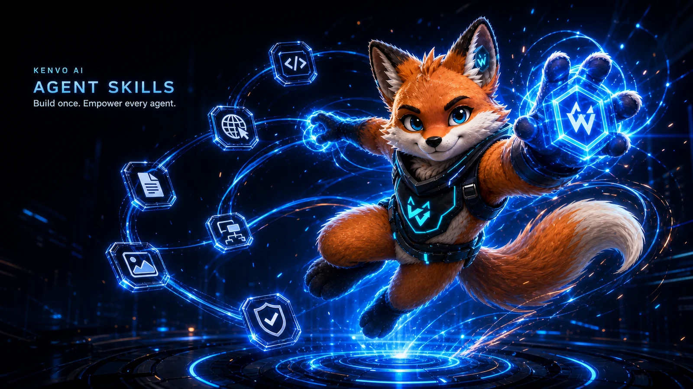

# Agent 技能集

这里收录了一组使用中文编写的 AI Agent 技能，适合直接用于项目开发。

## 开发类

| 技能 | 介绍 |
| --- | --- |
| [optimize-prompt-stack](./skills/development/optimize-prompt-stack/) | 审查并优化面向 GPT-5.6 的项目提示词栈，支持迁移、渐进调整和前后效果对比。 |
| [karpathy-guidelines](./skills/development/karpathy-guidelines/) | 一套面向 GPT-5.6 的轻量编码规则，用于减少过度设计、范围偏移和验证不足。 |
| [fireworks-tech-graph](./skills/development/fireworks-tech-graph/) | 将系统、流程和 AI/Agent 描述转为通过几何门禁的技术图，内置 12 种风格与 14 种 UML 图类型，支持 SVG、PNG、语义 GIF 和离线 HTML。 |
| [codex-git-cicd](./skills/development/codex-git-cicd/) | 为 Codex 与 GPT-5.6 提供 Git、worktree、CI/CD、失败恢复和最大化 handoff 的智能自动驾驶闭环。 |

## 设计类

| 技能 | 介绍 |
| --- | --- |
| [apple-design](./skills/design/apple-design/) | 将 Apple 的界面设计与流体物理动效方法论翻译到 Web 平台，涵盖手势驱动 UI、弹簧动画、可中断过渡、材质层次与排版。 |

## 演示文稿类

| 技能 | 介绍 |
| --- | --- |
| [open-slide-export-editable-pptx](./skills/presentation/open-slide-export-editable-pptx/) | 将 Open Slide React 幻灯片高精度导出为可编辑 PPTX，保留演讲备注，并通过 OOXML 与 Microsoft PowerPoint 实机验收。 |

## 游戏类

| 技能 | 介绍 |
| --- | --- |
| [img2threejs](./skills/game/img2threejs/) | 将参考图重建为带细节门禁、动画层级和交互规划的程序化 Three.js 游戏资产。 |
