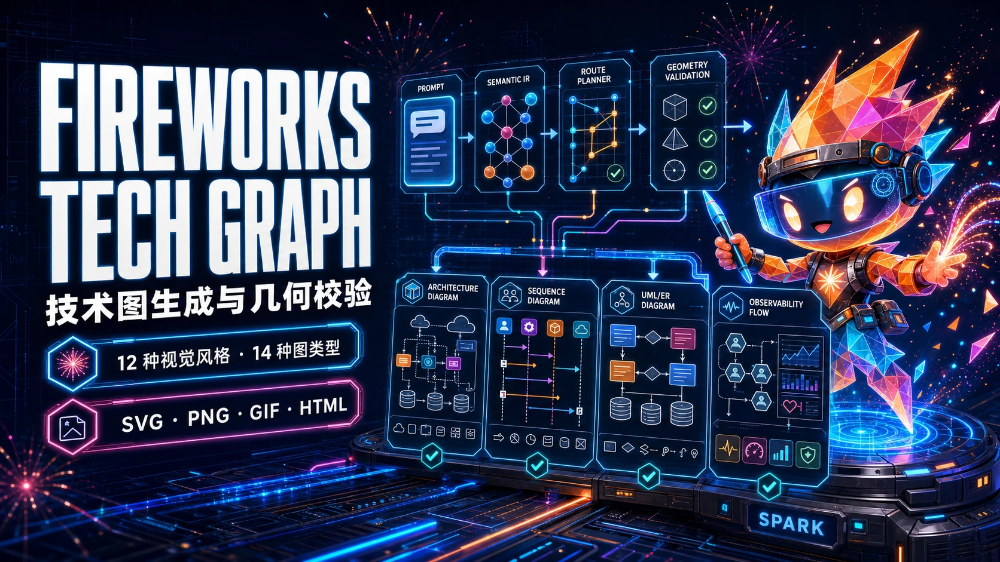
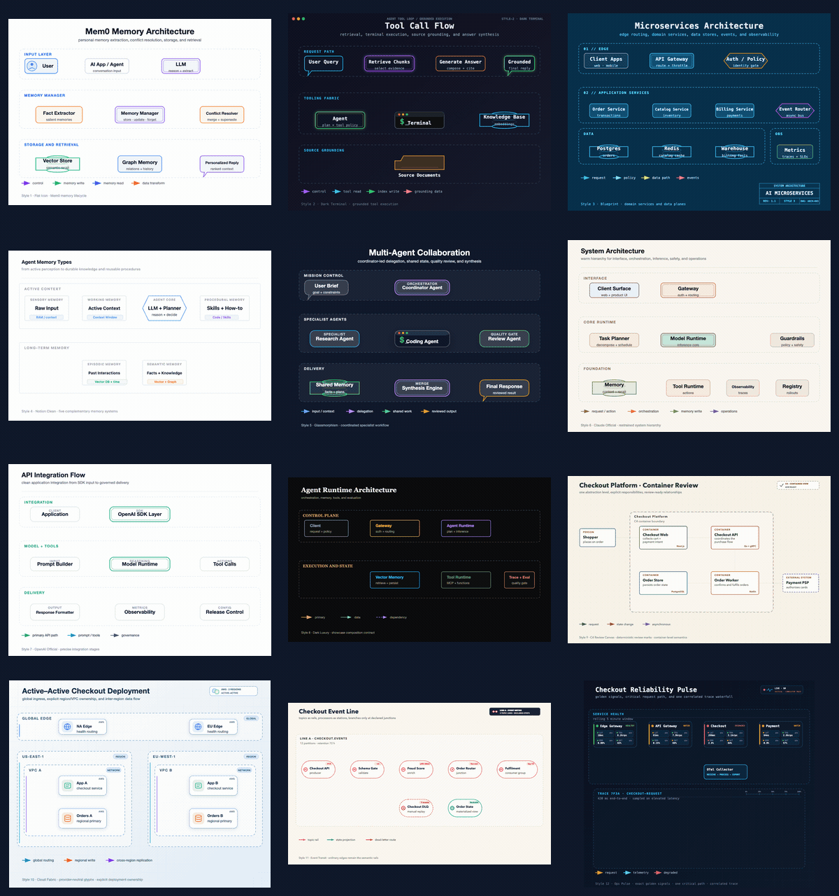
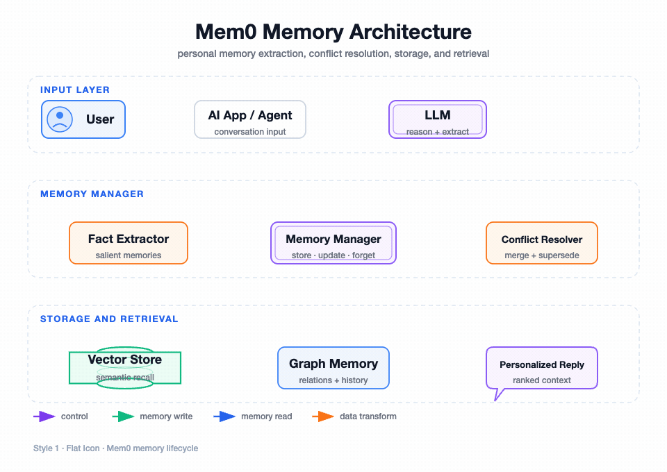
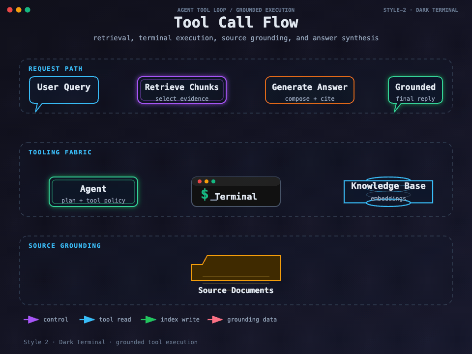
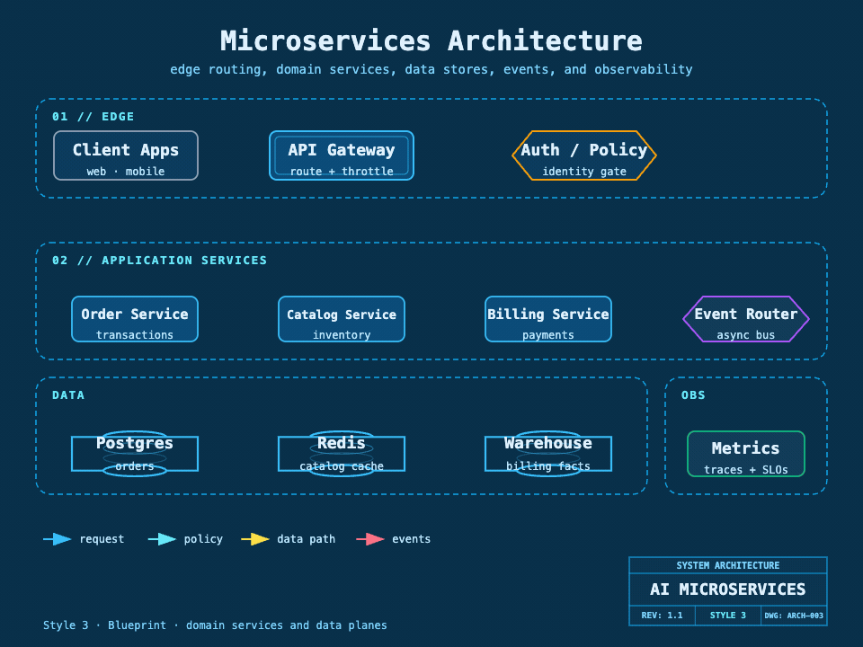
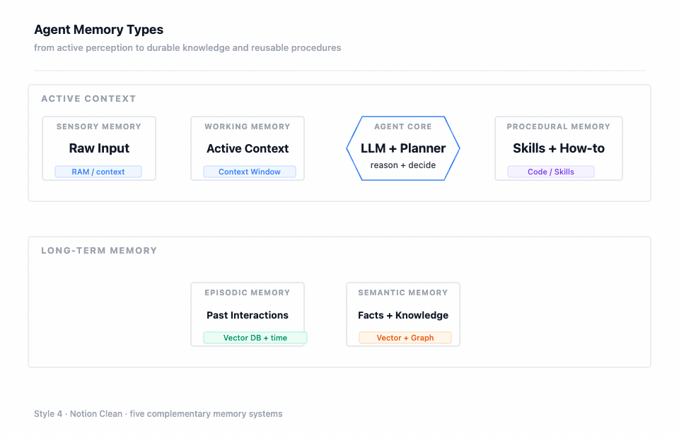
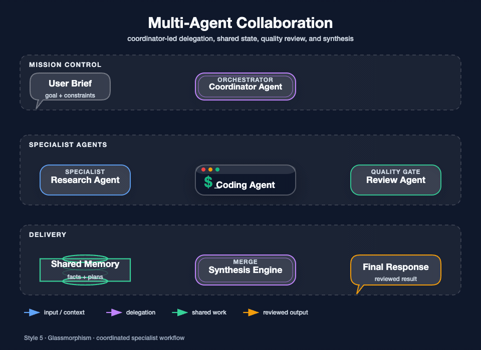
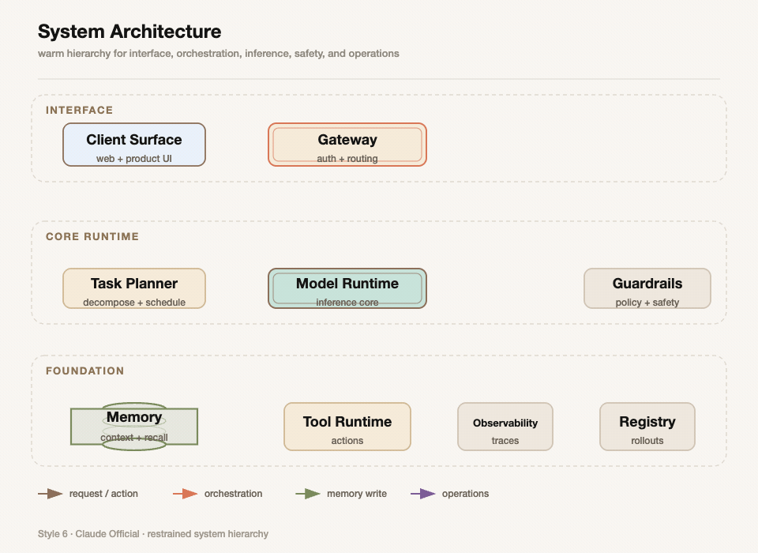
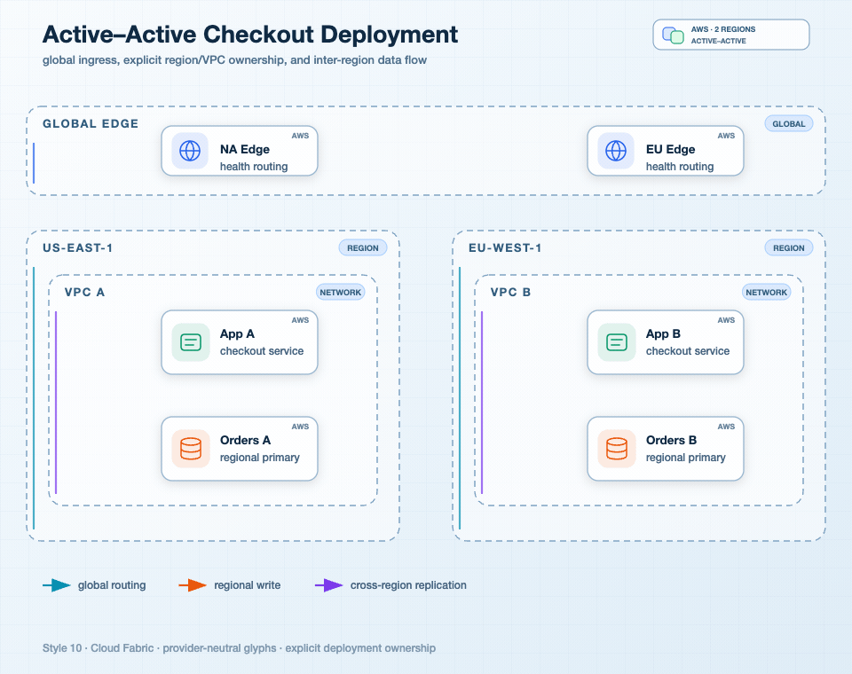
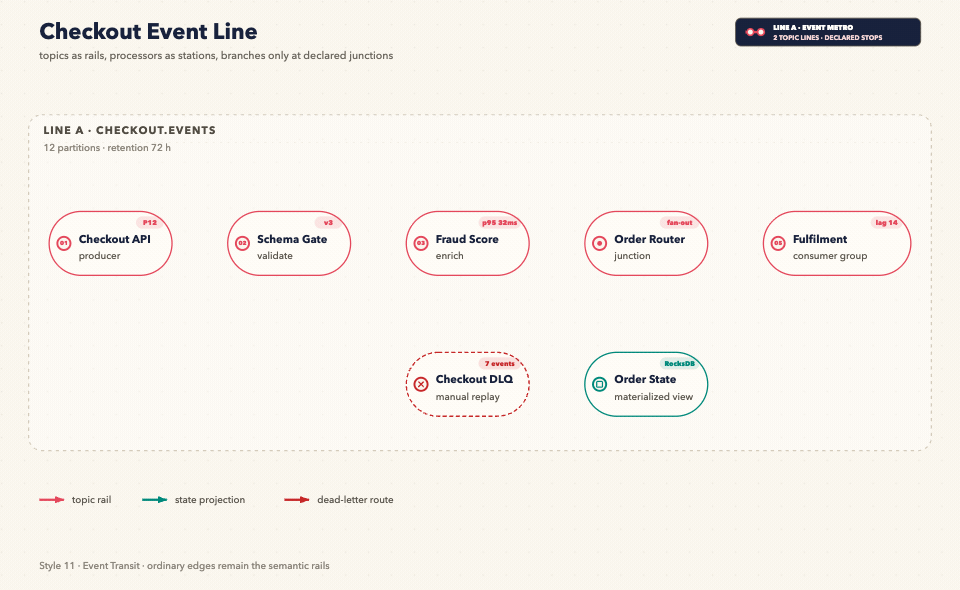

[完整中文文档](README.zh.md) · [上游项目](https://github.com/yizhiyanhua-ai/fireworks-tech-graph) · [版本历史](docs/releases/README.md) · [更新日志](CHANGELOG.md)

# fireworks-tech-graph

> 不用手画图了。用中文描述你的系统，直接得到通过几何门禁的 SVG、PNG、聚焦的 SVG 转 GIF 动效与离线交互技术图。

本目录内化了上游 v1.2.0 的完整 Skill 发行包，包含统一 CLI、12 种视觉风格、14 种 UML 图类型、Diagram IR、工程语义契约、模板、schema、fixtures、测试、静态/动效样例与离线交互导出。

## 核心能力

- **自然语言生成技术图**：架构图、流程图、数据流、时序图、网络拓扑、UML、ER、时间线、知识图谱和 AI/Agent Pattern。
- **12 种视觉风格**：扁平图标、暗黑极客、工程蓝图、Notion、玻璃态、Claude、OpenAI、暗黑奢华、C4、Cloud Fabric、Event Transit、Ops Pulse。
- **工程语义契约**：C4 层级、云资源归属、事件轨道、Golden Signals 等事实在渲染前 fail closed。
- **几何门禁**：检查路径、marker、箭头穿框、折点、间距、标签、图例和画布边界。
- **Loop Engineering**：结构校验后实际导出 PNG，再视觉回读并进行最多两轮定向修正。
- **多格式交付**：可编辑 SVG、1920px PNG、5.75 秒语义 GIF、单文件离线交互 HTML。

## 快速使用

```text
使用 $fireworks-tech-graph 画一张 Mem0 记忆架构图，采用暗黑极客风，同时输出 SVG 和 PNG。
```

```text
使用 $fireworks-tech-graph 生成 C4 Checkout Review，先验证职责、技术栈和协议，再导出离线交互 HTML。
```

```text
使用 $fireworks-tech-graph 让刚才的技术图动起来，输出通过语义动效验证的 GIF。
```

动效遵循上游已验收契约：`connectors begin absent`，随后进入持续数据流；Style 5 使用 `glass task capsule`，Style 4 使用 `14×10` memory card。默认时长为 `5.75 seconds`。`All twelve style contracts are user-approved`，直接说 `Generate a GIF` 也会进入同一语义动效流程。

## 统一 CLI

```bash
SKILL_ROOT="${CLAUDE_SKILL_DIR:-$HOME/.agents/skills/fireworks-tech-graph}"

python3 "$SKILL_ROOT/scripts/fireworks.py" doctor
python3 "$SKILL_ROOT/scripts/fireworks.py" validate architecture input.json
python3 "$SKILL_ROOT/scripts/fireworks.py" render architecture input.json diagram.svg --report layout.json
python3 "$SKILL_ROOT/scripts/fireworks.py" check diagram.svg
python3 "$SKILL_ROOT/scripts/fireworks.py" export-html diagram.svg diagram.html --title "System Architecture"
python3 "$SKILL_ROOT/scripts/fireworks.py" animate diagram.svg diagram.gif
```

## 安装路径

Codex 与 Claude Code 可以共用一份可编辑安装，也可以分别安装：

```text
~/.agents/skills/fireworks-tech-graph
~/.claude/skills/fireworks-tech-graph
```

PNG 推荐安装 `cairosvg`。GIF 额外需要 FFmpeg、Chrome/Chromium，并在 Skill 根目录安装固定版本运行时：

```bash
npm install --prefix "$SKILL_ROOT" --ignore-scripts --no-save --package-lock=false puppeteer-core@25.3.0
```

完整安装、12 风格展示、图类型、形状词汇表、箭头语义、产品图标与故障排查见 [README.zh.md](README.zh.md)。

## 12 种风格动态展示



| 风格 | 已验收动态样例 |
| --- | --- |
| 1 · 扁平图标 |  |
| 2 · 暗黑极客 |  |
| 3 · 工程蓝图 |  |
| 4 · Notion 极简 |  |
| 5 · 玻璃态卡片 |  |
| 6 · Claude 风格 |  |
| 7 · OpenAI 风格 |  |
| 8 · 暗黑奢华 |  |
| 9 · C4 评审画布 |  |
| 10 · Cloud Fabric |  |
| 11 · Event Transit |  |
| 12 · Ops Pulse |  |

## 目录内容

- `SKILL.md`：中文执行合同、路由、门禁与交付标准。
- `README.zh.md`：上游完整中文手册与动态样例。
- `scripts/`：统一 CLI、渲染、校验、动效与离线 HTML 导出。
- `references/`：12 种风格、构图、图标、PNG 与动效契约。
- `schemas/`：版本化 Diagram IR schema。
- `templates/`：架构、数据流、流程、时序、状态机、ER 等 SVG 模板。
- `fixtures/`：12 种风格与工程语义回归数据。
- `assets/samples/`：已验收 PNG/GIF 样例与 manifest。
- `tests/`：CLI、IR、几何、语义、动效、交互导出和兼容性测试。
- `assets/cover.optimized.webp`：本仓库发布封面。

## 来源与许可

- 上游：[yizhiyanhua-ai/fireworks-tech-graph](https://github.com/yizhiyanhua-ai/fireworks-tech-graph)
- 版本：`1.2.0`
- License：MIT，详见 [LICENSE](LICENSE)。
