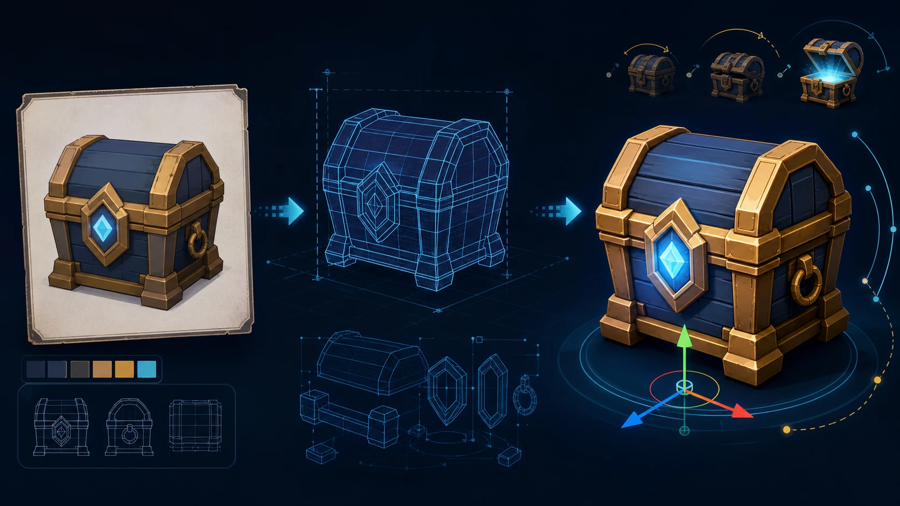

# img2threejs

把一张参考图转成可运行、可动画、可交互的程序化 Three.js 游戏资产。

## 在线体验

[打开 Cloudflare Pages WebGL Demo](https://img2threejs-demo.pages.dev/demo?model=car)

Demo 内含宝箱、概念摩托和多视图 GT 赛车三个模型。GT 赛车示例使用六向正投影、四个三分之四
视角及八组细节特写共同约束车体、轮组、空气动力套件和 PBR 材质。默认的多视图投影模式用于
保留证据视角的原始像素细节；“纯 3D 结构”按钮用于检查可旋转的程序化几何。这里的高精度指
固定证据视角下的视觉还原，不代表已经生成可在任意角度保持同等细节的生产级网格。

这个 Skill 适合游戏原型、网页 3D、道具重建、角色草模、可破坏物件和材质研究。它要求
Agent 先判断图片是否适合 3D 重建，再建立细节清单和 `SculptSpec`，按 blockout → 结构 →
形体 → 材质 → 灯光 → 交互 → 优化逐阶段生成 TypeScript `THREE.Group` 工厂，并用浏览器
截图与参考图做质量门禁。

## 能力边界

- 代码只使用 Three.js 原语、曲线、挤出、实例化、程序化材质和生成纹理，不下载网格或艺术包。
- Python 工具链为标准库实现，Python 3.10+，无需 pip、PIL、NumPy 或 Playwright。
- 单张图片无法可靠恢复隐藏面，也不能承诺真人 100% 相似；遇到信息不足时会要求更多视角、
  接受风格化，或缩小目标范围。
- “可行”指能生成质量受门禁约束的游戏原型资产；生产级雕刻、拓扑、UV、烘焙和最终动画仍需
  按项目工具链处理。

## 使用方式

将参考图路径、目标类型和游戏运行约束交给 Agent，例如：

> 用 `skills/game/img2threejs`，把这张宝箱图重建为可打开、可破坏的 Three.js 游戏道具；目标是浏览器实时运行，要求暴露 lid pivot、interaction socket 和 collider 规划。

脚本从本目录执行。完整流程和参数见 [SKILL.md](./SKILL.md) 与 [grimoire/scripts.md](./grimoire/scripts.md)。

```bash
python3 forge/tests/test_pipeline.py
```

## 来源与许可

本目录内的 `forge/`、`grimoire/` 和 `SKILL.md` 基于 [hoainho/img2threejs](https://github.com/hoainho/img2threejs)
整理，保留其 MIT 许可证，详见 [LICENSE](./LICENSE)。

目录内容：

- `SKILL.md`：触发范围、分阶段流程、质量门禁和游戏运行时约束。
- `forge/`：图片探测、评估、规格生成、校验、Three.js 工厂生成和复核脚本。
- `grimoire/`：3D 术语、几何/材质配方、角色路线、连接点和自校正规则。
- `assets/cover.optimized.webp`：README 发布封面。
