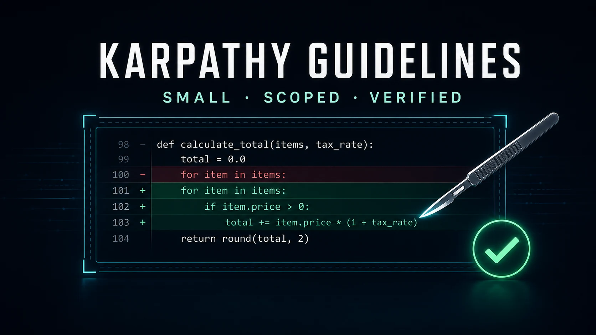

# Karpathy Guidelines for GPT-5.6

一组面向 GPT-5.6 编码任务的轻量纠偏规则，用于抑制过度设计、范围漂移、无关重构和无效验证。

它不是每次修改都必须加载的常驻流程。适合在用户明确调用，或任务存在较高复杂化风险、严格范围边界、模糊完成标准时按需使用。

## 核心原则

- 以最小但完整、可维护的变更交付用户目标。
- 对可逆且低风险的信息缺口做合理假设，避免不必要追问。
- 不添加未请求的功能、抽象、配置或兼容层。
- 保留现有架构和风格，把无关清理留在当前补丁之外。
- 根据变更风险选择最小充分验证，而不是机械要求测试先行或全量检查。

## 典型调用

```text
使用 $karpathy-guidelines 修复这个问题，只做最小范围修改并完成相关验证。
```

```text
使用 $karpathy-guidelines 审查这个实现是否存在过度设计、范围漂移或验证不足。
```

## 不建议自动触发

- 文案、翻译等非编码任务；
- 已经边界清晰的单行或机械修改；
- 需要专门安全、迁移、发布或架构流程的任务，此时应优先使用对应 Skill。

## 目录内容

- [`SKILL.md`](./SKILL.md)：触发范围、执行规则、风险分级和完成检查。
- [`assets/cover.optimized.webp`](./assets/cover.optimized.webp)：发布用压缩封面。

## 封面制作记录

- 创建能力：[`ip-visual-designer`](../ip-visual-designer/SKILL.md)
- 执行模式：`cover`，角色引导者构图
- IP 参考：[`assets/agent-skills-cover.webp`](../../assets/agent-skills-cover.webp)
- 发布规格：1600 × 900 WebP
- 处理流程：以仓库 Kenvo AI 狐狸为身份锚点生成母版，再通过 `agent-image-opt` 检查、压缩和视觉验收
